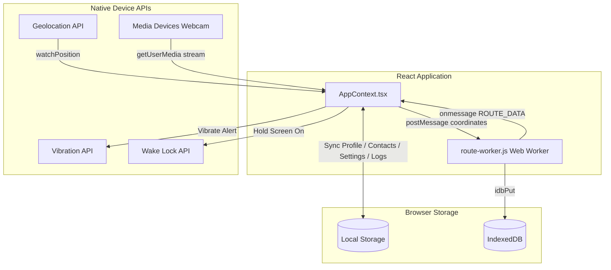

# SafeDrive AI - Complete Product Documentation & Technical Blueprint

SafeDrive AI is a state-of-the-art, futuristic **AI-powered Driving Safety Co-pilot**. It transforms any standard smartphone into an intelligent safety device that protects drivers on every journey. This document outlines the complete feature set, the modern technology stack, user-facing mechanics, and concrete technical implementation details.

---

## 1. Modern Technology Stack

SafeDrive AI is built using a highly optimized, modern client-side tech stack designed for low latency, smooth transitions, offline resilience, and cross-platform capability:

| Layer | Technology | Purpose & Context |
| :--- | :--- | :--- |
| **Core Frontend** | React 18 & TypeScript | Solid component structure, explicit type safety, and efficient rendering cycles. |
| **Styling & Theme** | Tailwind CSS & PostCSS | Custom dark-mode utility system featuring premium Glassmorphism cards and neon hues. |
| **Build Tooling** | Vite (Rolldown) | Ultra-fast Hot Module Replacement (HMR) and optimized chunk-splitting. |
| **Maps & Geospatial** | Leaflet & React Leaflet | Responsive rendering of dark-themed OpenStreetMap tiles and recorded polylines. |
| **Data Visuals** | Recharts | Interactive canvas-based line and bar charts to display safety trends. |
| **AI Computer Vision** | MediaPipe FaceMesh & tfjs | Low-latency facial landmark scanning (468 pts) running locally in WebGL. |
| **Native API Wrappers** | Geolocation, Wake Lock, Web SMS | Native device access for live speeds, screen-on locks, and emergency SMS. |
| **Concurrency & Storage** | Web Workers & IndexedDB | Background route logging, offline caching, and local preference storage. |

---

## 2. Core Feature Matrix & Implementation Details

SafeDrive AI offers **8 core pillars of safety**. Below is a summary of how they function for the driver and how they are implemented technically in the final product:

### 🚀 Feature 1: Launch Splash & Auto-Route Permission Gate
* **Basic Working**: When launching the app, the driver sees a futuristic loading progress ring. The app checks if setup has already been completed. If it's the driver's first time, it starts the Onboarding flow; otherwise, it boots straight to the Home Dashboard.
* **Technical Implementation**:
  * Utilizes React `useState` and dynamic intervals to simulate a fast-loading sequence.
  * Interrogates `AppState.userProfile.onboardingComplete` persisted in `localStorage` via a custom `useLocalStorage` hook.
  * Dynamically queries `navigator.permissions.query({ name: 'geolocation' })` and `navigator.mediaDevices.getUserMedia` to check permissions before showing blocking gates.

### 📝 Feature 2: Smart Onboarding & Medical ID Setup
* **Basic Working**: Drivers supply their name, medical details (Blood Group), and up to three Emergency Contacts. They can quickly import emergency contacts from their device address book in one tap instead of typing them manually.
* **Technical Implementation**:
  * Employs the native **Web Contacts API** (`navigator.contacts.select(['name', 'tel'])`) to request safe access to select address book contacts (available on modern Chrome Android and Safari iOS).
  * Validates and cleans inputs before packaging them into the `completeOnboarding` dispatch context.
  * Blood group buttons are designed with quick selection states that highlight instantly with high-contrast active shadows.

### 📊 Feature 3: Home Dashboard & Safety Co-Pilot HUD
* **Basic Working**: Displays quick-read cards detailing Live Vehicle Speed, overall Driving Safety Score, active road risk indicators, and emergency SOS status. An interactive, pulsing AI Co-Pilot voice wave animates when active.
* **Technical Implementation**:
  * Combines a dynamic custom `useClock` Hook with live geolocation watches.
  * Integrates the custom `VoiceWave` component using styled CSS height keyframes that simulate real-time vocal frequency oscillations.
  * Employs responsive grid layouts that adapt cleanly to any mobile screen ratio.

### 🚘 Feature 4: Live AI Drive Mode (HUD & Object Detection)
* **Basic Working**: When driving, the screen enters a high-contrast HUD mode. The phone camera scans the road, overlaying bounding boxes on cars, pedestrians, bikes, and trucks, calculating their relative distance. It shows live vehicle speed and sounds alerts if they get too close.
* **Technical Implementation**:
  * **Visual Overlays**: Renders responsive SVG perspective lines (`laneLines`) that scale to the camera container size, simulating smart lanes.
  * **Speeds**: Uses the **Geolocation API** (`navigator.geolocation.watchPosition`) to track real-time speeds in km/h (`pos.coords.speed` or consecutive Haversine interval calculations).
  * **Dynamic Speed Limits**: Queries the **OpenStreetMap Overpass API** dynamically in the background, matching current GPS coordinates with nearest road highway maxspeed tags (falls back to road defaults like Primary, School, Residential).
  * **Concurrency**: Spins up a dedicated **Background Web Worker** (`route-worker.js`) to buffer and write coordinate points to **IndexedDB** in a separate thread. This ensures GPS tracking survives if the browser tab is minimized or backgrounded.
  * **Wake Lock**: Requests a native **Screen Wake Lock** (`navigator.wakeLock.request('screen')`) to prevent the phone screen from sleeping during the drive.

### 🏁 Feature 5: Post-Drive Summary & Map Visualization
* **Basic Working**: When a drive ends, the app gives complete trip insights: final safety score, total km driven, number of harsh brakes, speed limit violations, and plots the recorded driving route on an interactive dark map.
* **Technical Implementation**:
  * Integrates `react-leaflet` to render OpenStreetMap tiles styled with CartoDB Dark Matter CSS.
  * Plots a custom `<Polyline>` overlay using the IndexedDB-saved coordinates merged from the web worker.
  * Overrides Leaflet's default marker image URLs (often broken by asset bundlers) with manual Retinal CDN icons.
  * Includes a custom `<FitBounds>` Leaflet hook to automatically zoom and pan the map to center on the start, route path, and end coordinates.

### 👁️ Feature 6: AI Driver Drowsiness & Fatigue Monitoring
* **Basic Working**: Uses the front camera to scan the driver's eyes and head tilt. If the eyes stay closed or the head tilts downwards (drowsiness) for more than 2 seconds, it sets off an alert, vibrates the phone, and sounds warning prompts.
* **Technical Implementation**:
  * **Camera Feed**: Renders the video feed stream using `<Webcam>` (`react-webcam`).
  * **Face Tracking**: Dynamically imports and instantiates the **MediaPipe FaceMesh** model, drawing 468-point neural mesh dots on a synchronized `<canvas>` overlay.
  * **EAR Calculation**: Computes the **Eye Aspect Ratio (EAR)** using specific coordinate indexes for the left and right eyes (indices `[362, 385, 387, 263, 373, 380]` and `[33, 160, 158, 133, 153, 144]`).
  * **Vibrations**: Employs the native browser **Vibration API** (`navigator.vibrate([400, 200, 400])`) to physically shake the phone during alerts.
  * **Self-Healing Fallbacks**: If permissions are denied or in insecure contexts, the page automatically boots to **Simulated Demo Mode** rather than locking the screen. Includes an in-frame warning overlay with a dynamic "Retry" button.

### ⚖️ Feature 7: AI Legal & Compliance Assistant
* **Basic Working**: An interactive AI chat assistant focused on traffic regulations and compliance. Drivers can ask or tap suggested topics (e.g. helmet fines, seatbelt rules, drunk driving laws, triple riding) to get legal rules, exact fine amounts, and safety advice.
* **Technical Implementation**:
  * Renders a highly responsive messaging layout featuring scroll-to-bottom effects (`scrollTo({ behavior: 'smooth' })`).
  * Implements keyword indexing and matching arrays to retrieve precise data structures (Rule, Fine, Advice).
  * Simulates vocal speech recognition using a custom mic interaction toggle.

### 🚨 Feature 8: AI Incident & Civic Hazard Reporter
* **Basic Working**: If the driver encounters road hazards (e.g. potholes, broken traffic lights, drainage waterlogging), they can snap a photo. SafeDrive AI scans the image, classifies the hazard, identifies severity, and automatically routes the report to the correct civic department with coordinates.
* **Technical Implementation**:
  * Uses a hidden HTML `<input type="file" accept="image/*">` input triggered by custom camera buttons to support mobile uploads.
  * Employs standard `FileReader.readAsDataURL` to parse and render file previews.
  * Triggers a mock-analyzing scanning overlay before selecting and routing hazard metadata (GHMC Drainage, NHAI PWD, TS Traffic Police).

---

## 3. Persistent Data Architecture & Context Flow

### Persistence Mechanics:
1. **Settings, Emergency Contacts, Profile, and Drive Logs** are synced with **LocalStorage** on every state mutation using React `useEffect` hooks paired with local storage sync dispatches.
2. **Recorded Drive GPS Coordinates** are sent to the background **Web Worker** which commits them to **IndexedDB** in a separate thread. This prevents data loss during browser tab suspends, rendering the map route perfectly when a drive finishes.
